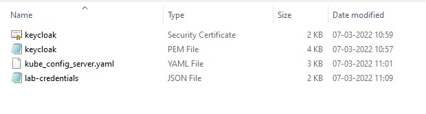
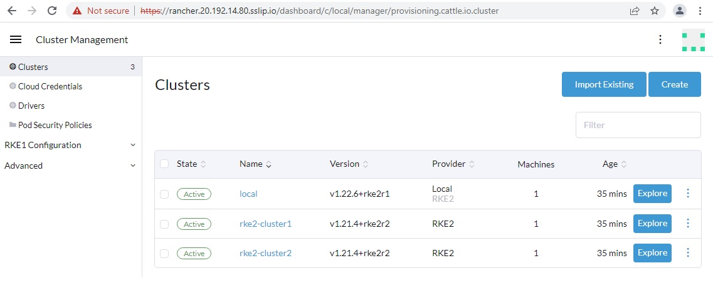
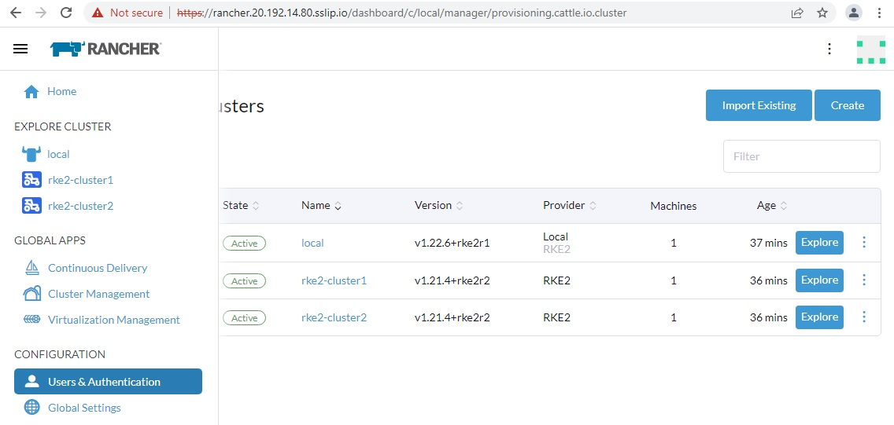
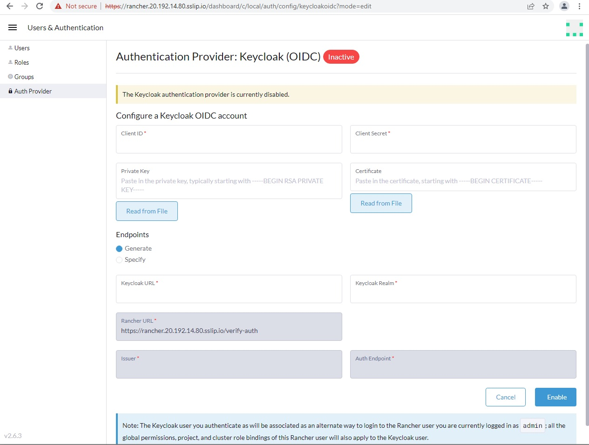
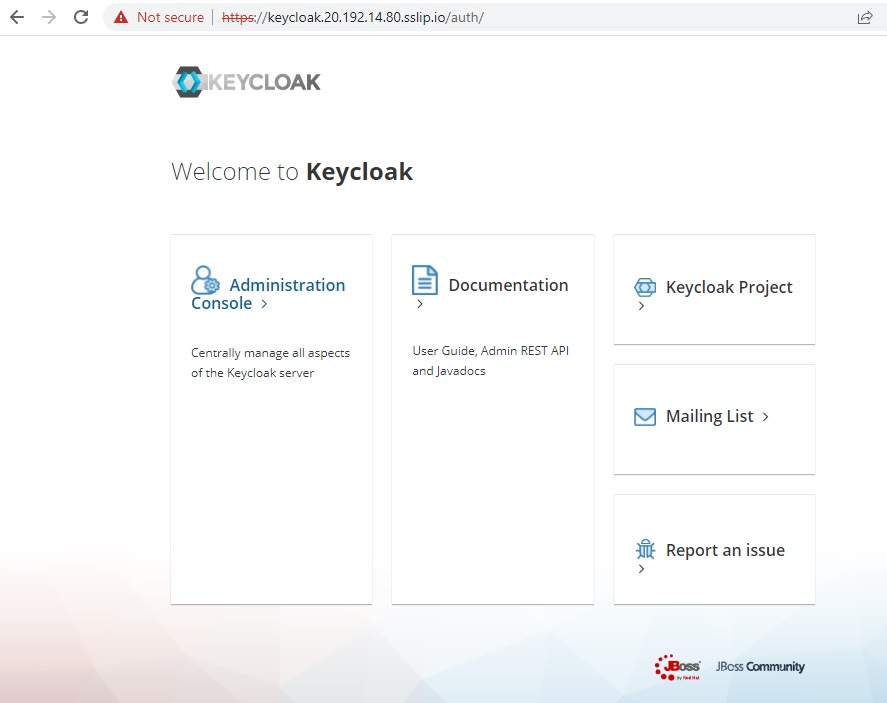
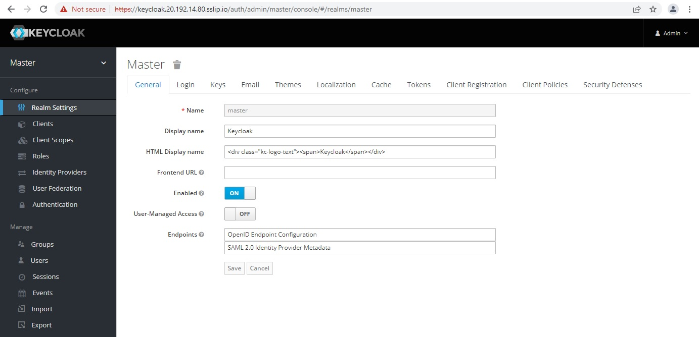

# Keycloak Integration with Rancher

As a part the workshop we have pre-deployed **SUSE Rancher Server, Keycloak and Elastic Search & Kibana** for you.

The credentials for accessing **Lab environment** has been shared as web URL link with you. 

You need to download the zip file and upon extraction you will find below **4 files**.

1. **keycloak.crt** 
2. **keycloak.pem**
3. **kube_config_server.yaml**
4. **lab-credentials**    (**This file has got all your lab URL's and login credentials for Rancher, Keycloak and Elastic Search & Kibana**)

## Accessing SUSE Rancher server

Open **lab-credentials** file 

Look for keyword **"rancher_server_url"**, **"rancher_server_user"** and **"rancher_server_password"** 

Copy and past Rancher URL link in your favourite browser.

Rancher URL = **"rancher_server_url"**

user = **admin**

password = **"rancher_server_password"**

Since Rancher is built using self-signed certificated and it's not a valid certificate from authorized CA, your browser will give warning. You can safely click on link "Proceed to rancher-IP.sslip.io (unsafe)" to login.

Once you login, you will be at the Rancher Homepage, You should be able to see 3 Clusters which are pre-provisioned as part of the workshop.

### Getting familiar with Rancher UI

Navigate Home > Global Apps > Cluster Management > Clusters

You will all clusters in the cluster list.

For this workshop we are interested in User & Authentication.  Navigate to the section below

Home > Configuration > Users and Authentication

Under User & Authentication, you can view/create Users, Roles & Configure and Manage external Authentication Provider.  

Under Users, you will local admin for Rancher. Rancher provide a unique ID to the user for it's records.

To access list of available External Authentication providers click on Auth Provider. 

For this workshop we will be using **Keycloak OIDC**. 

Below is the configuration form page to the configure Keycloak with Rancher. 

We have completed our navigation for Rancher

## Accessing Keycloak Server

Open lab-credentials file 

Look for keyword **"keycloak_url"**, **"keycloak_admin_user"** and **"keycloak_admin_password"**

Copy and past **Keycloak URL** link in your favourite browser.

Keycloak URL = **"keycloak_url"**

user = **admin**

password = **keycloak_admin_password**

Since Keycloak is built using self-signed certificated and it's not a valid certificate from authorized CA, your browser will give warning. You can safely click on link "Proceed to rancher-IP.sslip.io (unsafe)" to login.

Click on **Administration Console** to login into Keycloak

Upon successful login, you will be presented with Keycloak homepage

With this, we have successfully completed all required steps in **Exercise 1: Accessing Rancher and Keycloak**. 

We are ready to move to the **Exercise 2: [Exercise-2-Configure-Keycloak.md](./Exercise-2-Configure-Keycloak.md)**