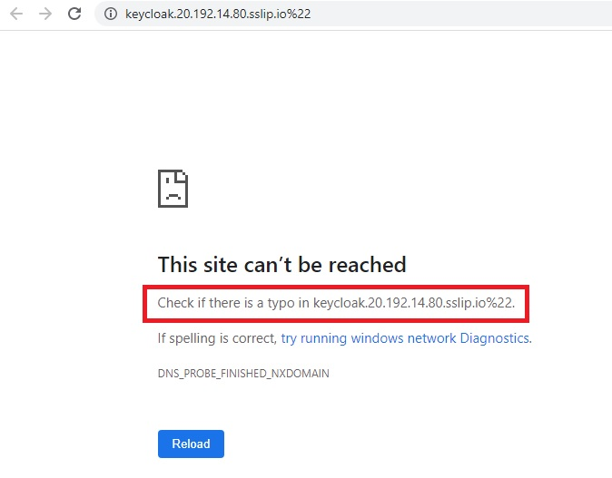

# Keycloak integration with Rancher

As a part the workshop we have deployed SUSE Rancher Server, Keycloak and EFK Stack for you.

The credentails for accessing above environemnt has been emailed to you on your registered email address which you have provided during workshop reistration.

## Accessing SUSE Rancher server

The url for accessing SUSE rancher is already shared over email, please copy and past in your favorite browser window.

Since Rancher is built using self-signed certificated and it's not a valid certificate from authorized CA, your browser will give warning. You can safely click on link "Proceed to rancher-IP.sslip.io (unsafe)" to login.

Your Rancher credentials are email to you, so use the credential provided to login. 

Once you login, you will be at the Rancher Homepage, You should be able to see 3 Cluster which are pre-provisioned as part of the workshop.

For management of the cluster you can navigate to Global Apps > Cluster Management > Clusters

You will all cluster in the cluster list.

For this workshop we are instresed in User & Authentication.  To Navigate to the section where you can create & manage User, 

Home > Configuration > Users and Authentication

Under User & Authentication, you can view/create User, Role & configure and manage external Authentication Provider.  

Under Users, you will local admin for Rancher. Rancher provide a unquie ID to the user for it's records.

To access list of available External Authentication provider click on Auth Provider. 

For our workshop we will be using Keycloak OIDC. Below is the configuration we will require to the configure KeyClock with Rancher. 

In the upcoming section, we will configure Keycloak.

## Accessing Keycloak server

To access Keycloak, revisit our email shared which has the URL and credentials for accessing Keycloak server.  You can use your favorite browser and credential provided to Login in Keycloak. 

Since Keycloak is built using self-signed certificated and it's not a valid certificate from authorized CA, your browser will give warning. You can safely click on the link "Proceed to Keycloak-IP.sslip.io (unsafe)" to login.

In-case if you URL fail to load, check the URL. It should be "https://keycloak.IP.sslip.io"  

Click on Administration Console to login into Keycloak.

Provide the Keycloak credentials

Upon successful login, you will be presented below keycloak homepage

