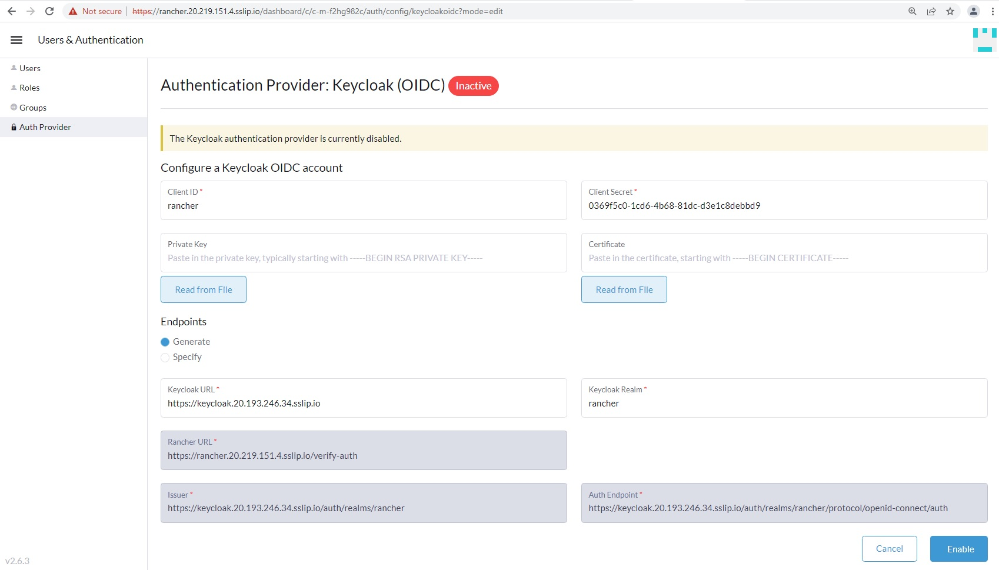

# Keycloak Integration with Rancher

In this **Exercise-3**, we will Integrate Rancher with Keycloak

## Configuring Keycloak (OIDC) in Rancher UI

Open **lab-credentials** file 

Look for keyword **"keycloak_url"**

Copy Keycloak URL link and paste the URL in **Keycloak URL** field in **Rancher UI** as shown below

Keycloak URL = **"keycloak_url"**

Switch to **Rancher UI** and navigate below path

Home > Configuration > Users and Authentication > Auth Provider > Keycloak (OIDC)

Under **Endpoints** 

Keycloak URL =  **Keycloak URL** (copied earlier, Please note there should "NOT" be any forward **"/"** ending the URL )

Correct Sample URL =  https://keycloak.IP.sslip.io

Incorrect Sample URL = https://keycloak.IP.sslip.io/   **<<< "Invalid URL"**

Keycloak Realm = **rancher**

Client ID = **rancher**

Now update Keycloak **Private Key** and **Certificate** fields by refering below files

The credentials for accessing Lab environment has been shared as web URL link with you. 

The Keycloak Client Certificate and Private key has been shared as web URL link with you.

Open Keycloak.crt file copy the entire content and past in Certificate field.

Open Keycloak.pem file copy the entire content and past in Private Key field.

Click on **Enable** to apply the configuration

After clicking on **Enable**, you are prompted with a new window redirected to Keycloak UI for authentication

Username = admin

Password = **As set by you in Exercise-2**

Once you are authenticated successfully, your Keycloak OIDC will turn to **Active** state as below

Select radio button highlighted as **"Allow members of clusters and projects, plus authorized users & groups"**

Click on **Save** button

Logout from Rancher UI and Re-login as below

Now you notice new button **"Log in with Keycloak"** as been added

Click on **Log in with Keycloak** button

After clicking on **Log in with Keycloak** button, you automatically redirected to **Keycloak UI**

Username = admin

Password = **As set by you in Exercise-2**

Navigate **Rancher UI** as below

You notice that the **admin** user has full access to Rancher platform and all downstream clusters

Click on **Users & Authentication**

You notice **Default Admin** user listed from Keycloak Provider

With this, we have successfully completed all required steps in **Exercise 3: Integrate Rancher with Keycloak**. 

We are ready to move to the **Exercise 4: [Exercise-4-Create-Keycloak-Users-Role-Mapping](./Exercise-4-Create-Keycloak-Users-Role-Mapping.md)**
