# Keycloak integration with Rancher

As a part the workshop we have deployed SUSE Rancher Server, Keycloak and EFK Stack for you.

The credentails for accessing above environemnt has been emailed to you on your registered email address which you have provided during workshop reistration.

## Integrate Rancher with Keycloak

Copy Keycloak URL from Keycloak browser window as below

https://Keycloak.IP.sslip.io    <<<<<<<< This sample URL

Switch to Rancher UI to configure Keycloak (OIDC) 

Home > Configuration > Users and Authentication > Auth Provider > Keycloak (OIDC)

Under Endpoints > Keycloak URL, paste the Keycloak URL (copied earlier)

Keycloak Realm = "rancher"

Client ID = "rancher"

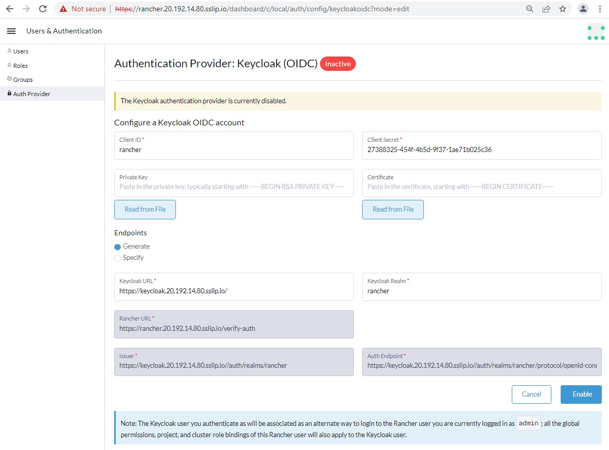

Copy Keycloak client certificate emailed to you << Need to check with Derek how to share to attendees

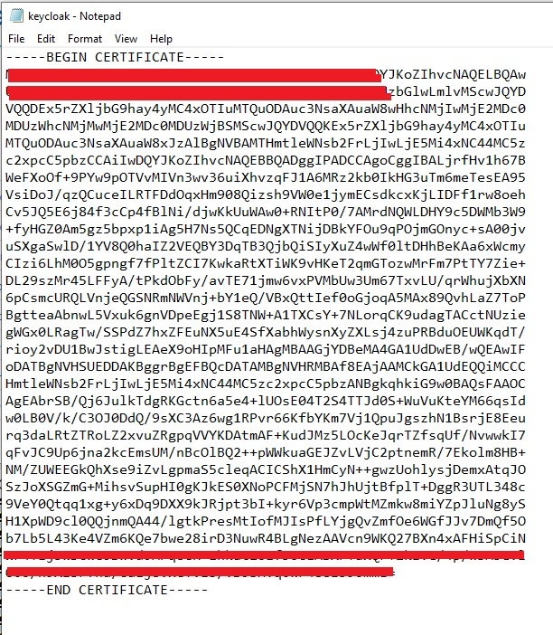

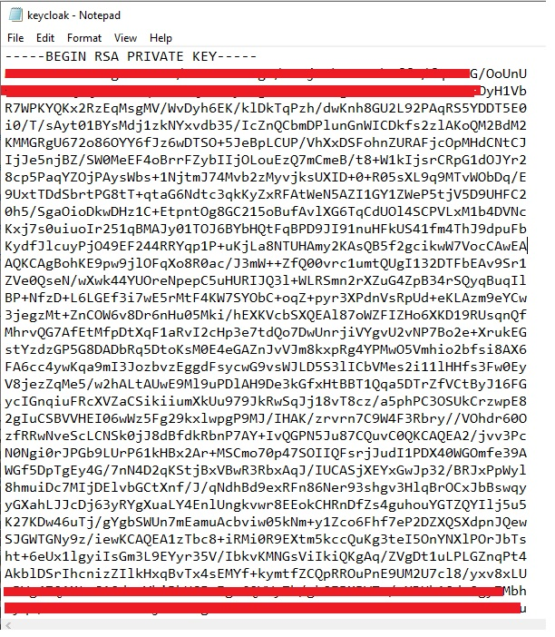

Paste them in their respective sections as below.

Click on Enable to save the configurations

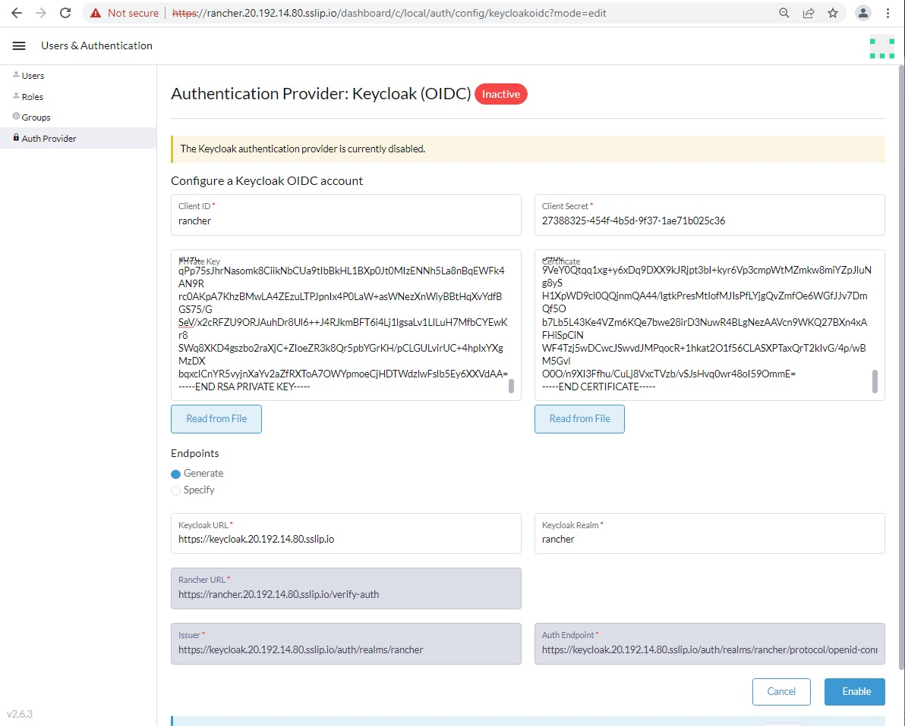

Once you Enable, you are prompted to authenticate to Keycloak for validations of the details provided

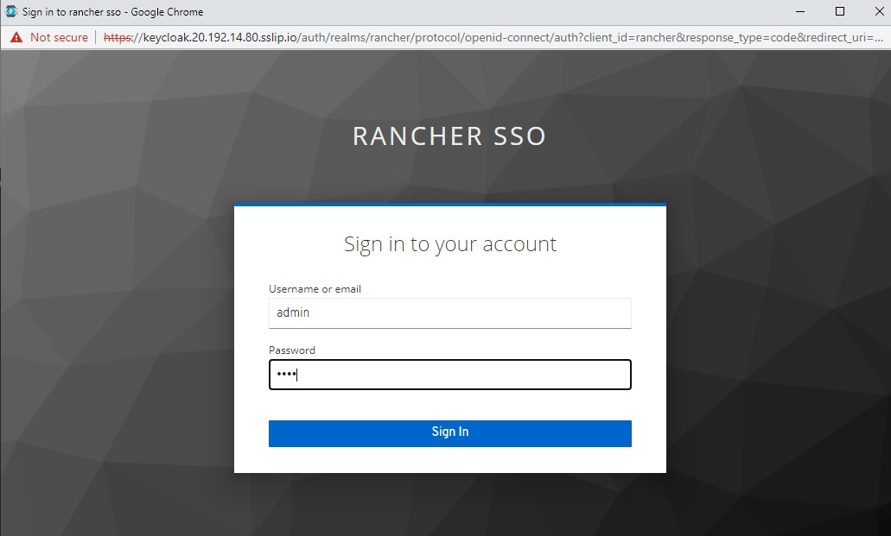

Once you are authenticated successfully, your Keycloak OIDC will tune to active state

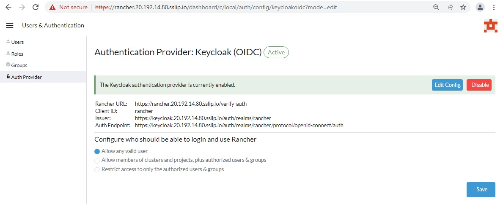

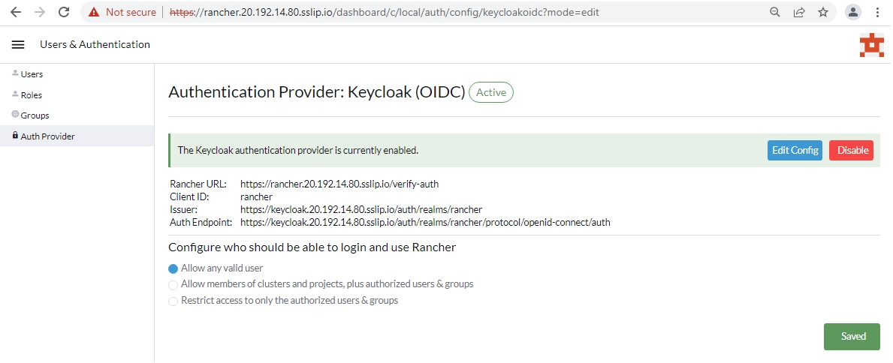

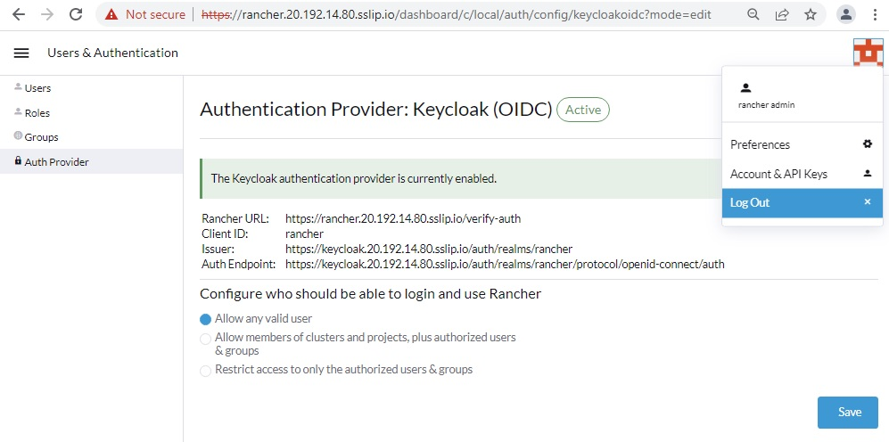

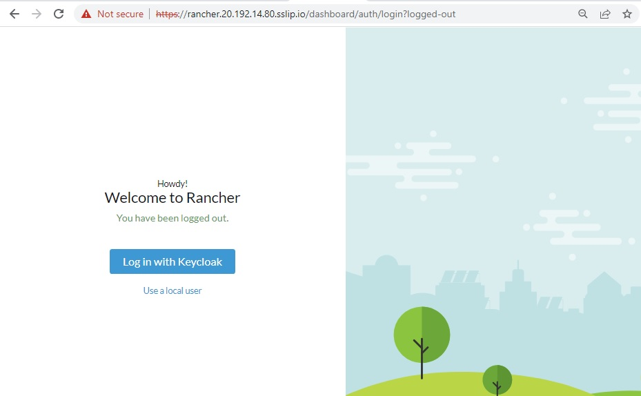

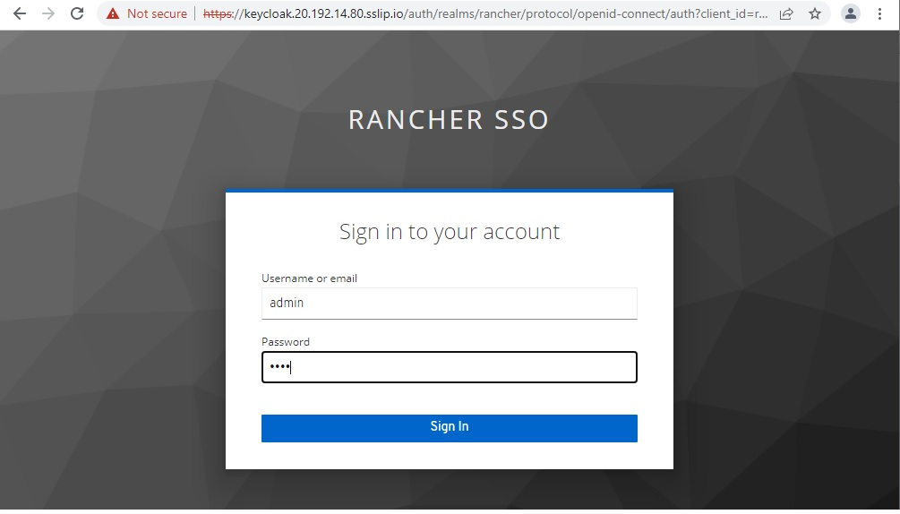

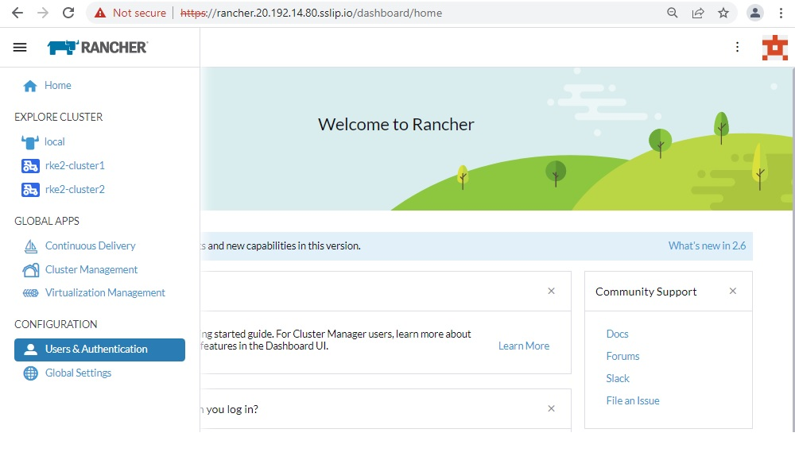

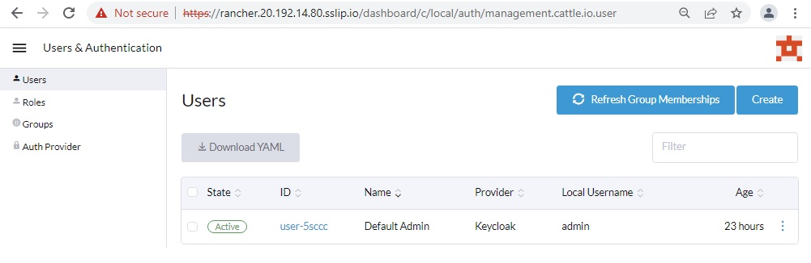

## Having trouble?

First, verify you have followed all written lab instructions (including the Before the Hands-on lab document).

Next, submit an issue with a detailed description of the problem.

Do not submit pull requests. Our content authors will make all changes and submit pull requests for approval.

If you are planning to present a workshop, review and test the materials early! We recommend at least two weeks prior.

Please allow 5 - 10 business days for review and resolution of issues.