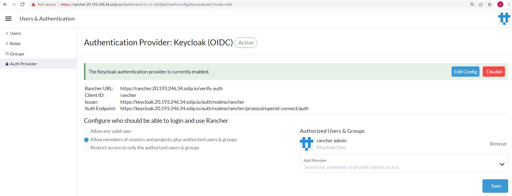
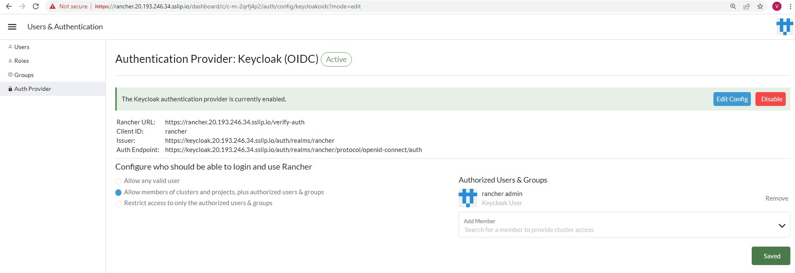

# Keycloak integration with Rancher

As a part the workshop we have deployed SUSE Rancher Server, Keycloak and EFK Stack for you.

The credentails for accessing above environemnt has been emailed to you on your registered email address which you have provided during workshop reistration.

## Rancher side configuration for Keycloak

Copy Keycloak URL from Keycloak browser window as below

https://Keycloak.IP.sslip.io    <<<<<<<< This sample URL

Switch to Rancher UI to configure Keycloak (OIDC) 

Home > Configuration > Users and Authentication > Auth Provider > Keycloak (OIDC)

Under Endpoints > Keycloak URL, paste the Keycloak URL (copied earlier)

Keycloak Realm = "rancher"

Client ID = "rancher"

The Keycloak Client Certificate and Private key has been shared over an email used during registration of this workshop, open them with notepad editor of your choice and copy & paste in the relevant section below.

Paste them in their respective sections as below.

Click on Enable to save the configurations

Once you Enable, you are prompted to authenticate to Keycloak for validations of the details provided

Once you are authenticated successfully, your Keycloak OIDC will tune to active state

With this, we have successfully completed all required steps in Exercise 3. We are ready to move to the Exercise 4 [Exercise-4-Create-Keycloak-Users-Role-Mapping](./Exercise-4-Create-Keycloak-Users-Role-Mapping.md)

