# Keycloak integration with Rancher

As a part the workshop we have deployed SUSE Rancher Server, Keycloak and EFK Stack for you.

The credentails for accessing above environemnt has been emailed to you on your registered email address which you have provided during workshop reistration.

## Create Keycloak Users and Groups

Configure users in Keycloak along with view/list access to other keycloak users and groups.

To access Keycloak, revisit our email shared which has the URL and credentials for accessing Keycloak server.  You can use your favorite browser and credential provided to Login in Keycloak. 

Since Keycloak is built using self-signed certificated and it's not a valid certificate from authorized CA, your browser will give warning. You can safely click on the link "Proceed to Keycloak-IP.sslip.io (unsafe)" to login.

Click on Administration Console to login into Keycloak.

Provide the Keycloak credentials

Under Realm "Rancher" > Manage > Users

Click "Add user"

Create / Name as below

Username = superadmin

First Name = superadmin

Last Name = admin

Rest all set to default settings

Click on Save

User creation Success

Next step is to set the user user credentials which would be used during login 

Click "Set Password"

You will be re-prompted to set password again

Now your user credentials are successfully set

Repeat the above steps of adding new user "admin1" and setting his credentials

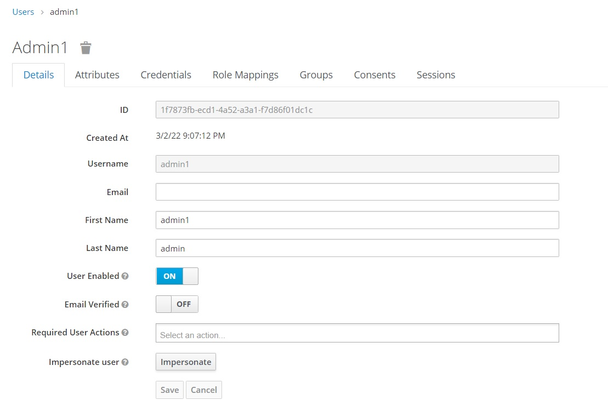

Finally check all required users are created as below

Modify each user role mappings by clicking Actions "Edit"

<<<<<<<<< highlight the Edit button

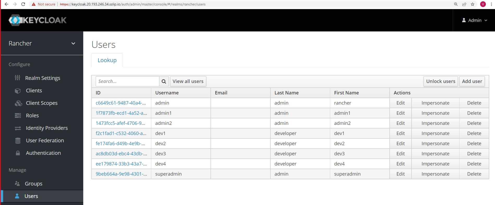

With Edit option you will be presented the tabs as below, select "Role Mappings"

Under Client Roles > select "realm-management" (dropdown)

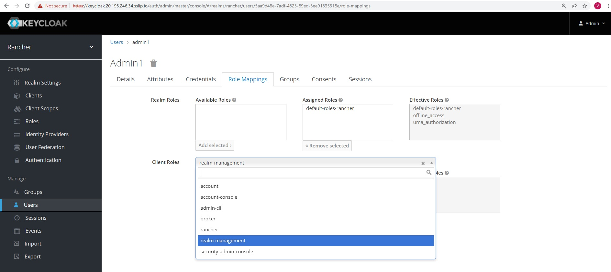

Under Available Roles, select view-users and click on Add selected

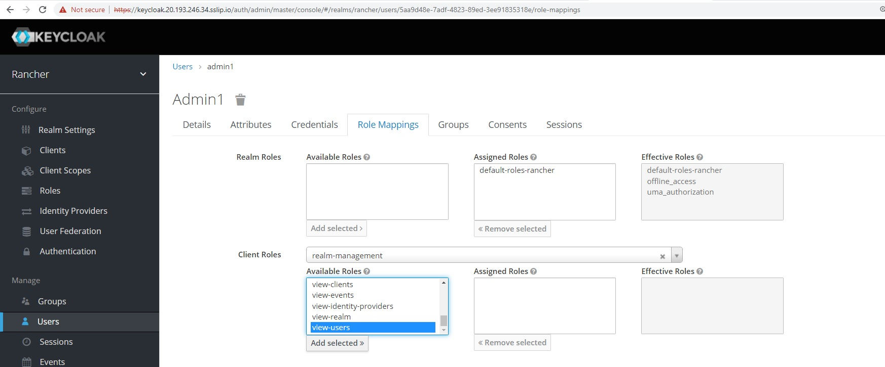

We have successfully assigned the roles "view-users"

You can now see them under the Effective Roles section

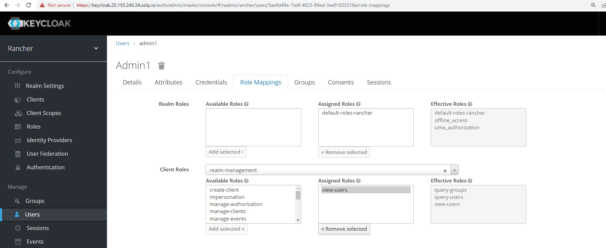

You need to repeat the above steps for Role Assignments  "view-users" for all the Keycloak users we created

Now Create Groups

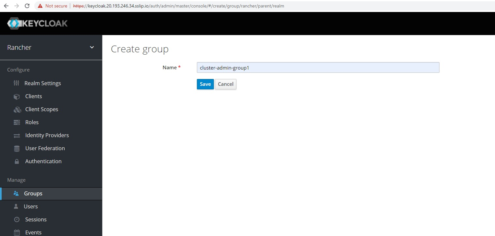

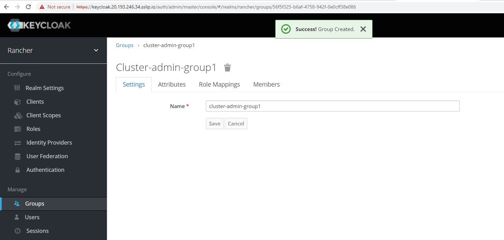

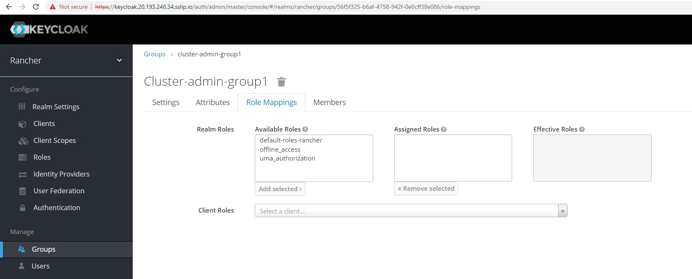

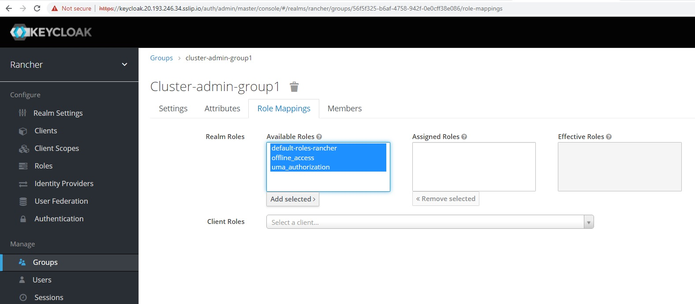

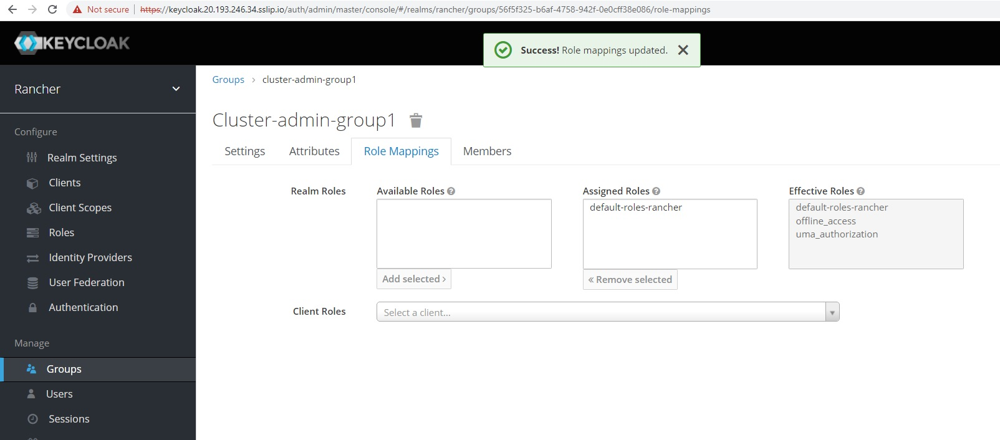

Now add user "admin1" to group "cluster-admin-group1"

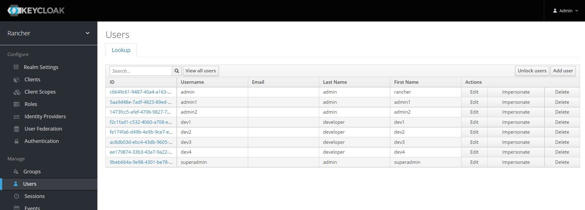

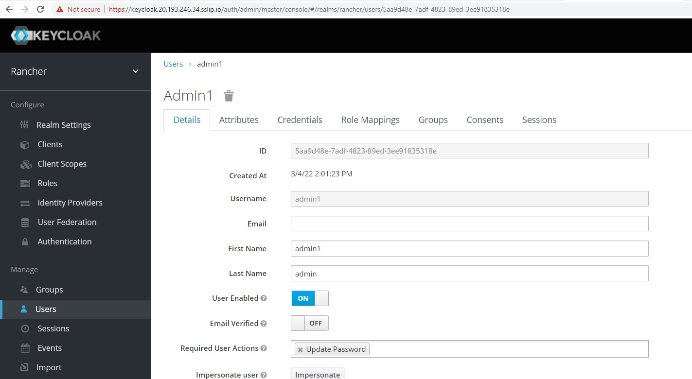

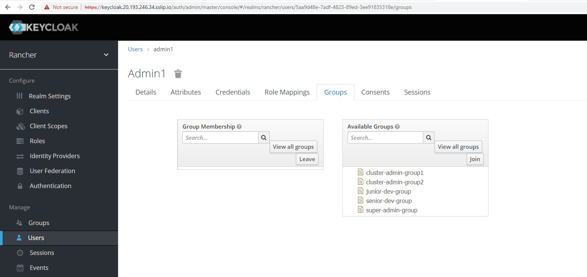

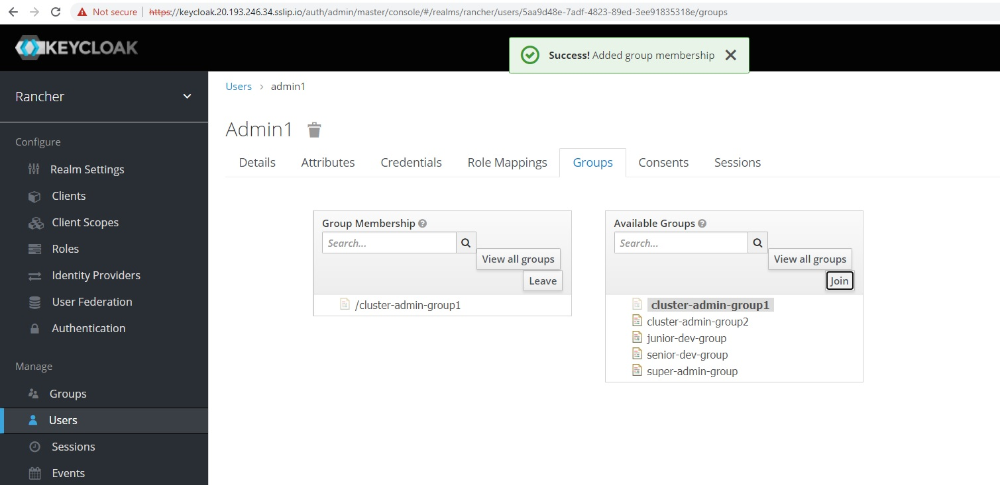

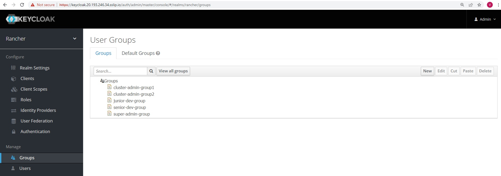

Now repeat above steps of adding users to respective groups as below.

admin1 ---> cluster-admin-group1

admin2 ---> cluster-admin-group2

dev1   ----> senior-dev-group

dev2   ----> senior-dev-group

dev3   ----> junior-dev-group

dev4   ----> junior-dev-group

superadmin ---> super-admin-group

Now assign admin user to all groups

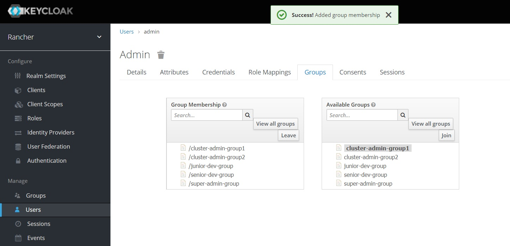

Switch to Rancher UI interface and add all keycloak groups as shown below

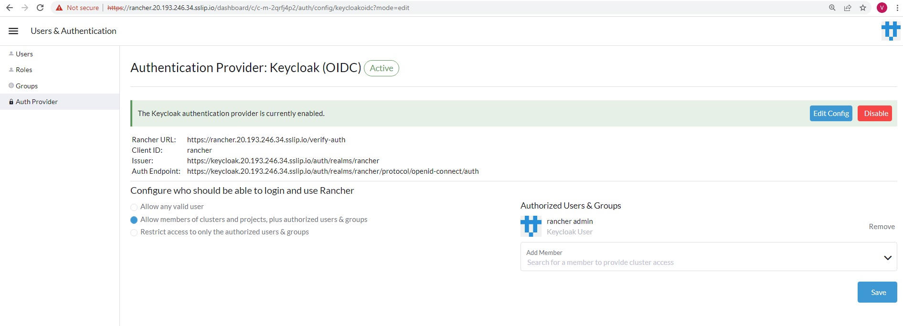

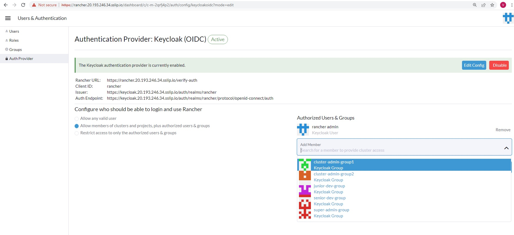

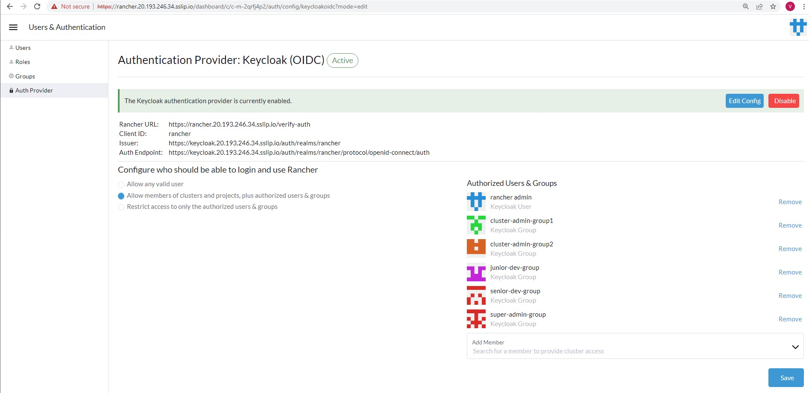

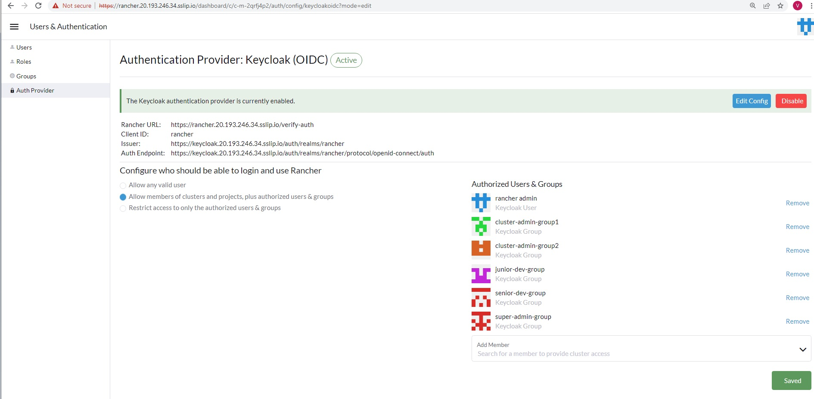

## Rancher Authentication

We will now login to Rancher with all the Keycloak users we created

The url for accessing SUSE rancher is already shared over email, please copy and past in your favorite browser window.

You will now notice in UI that you are presented with two options to authenticate in Rancher

1.  Use a Local user
2. Log in with Keycloak

Since we need to check authentication of newly created Keycloak users, we will use the option no. 2         "Log in with Keycloak"

<<<<<<<<<<<< highligh the below image

On clicking with "log in with Keycloak" you would automatically routed to Keycloak URL and you will presented with Keycloak login page

In the below example we are loggin with "superadmin" user and credentials 

You will be prompted to password reset

Upon successful login you will be routed to Rancher UI

<<<<<<< highlight the below image

If you notice on exploring the UI you will not find lot of Rancher features and existing downstream clusters which is typically visible to Rancher Admin

Log out from this session.

Login with rest of the users created in Keycloak by following above steps

superadmin, admin1, admin2, dev1, dev2, dev3, dev4

Now we have successfully logged in with all the above Keycloak users

The next step is to verify all the Keycloak users are reflected in its local database

For this we need to login as "admin" user using Keycloak option and using the credentials as set during Excercise-2.

Navigate to Home > Configuration > Users & Authentication > Users

Now you can see all Keycloak user are listed with provider "Keycloak" in Rancher local database.

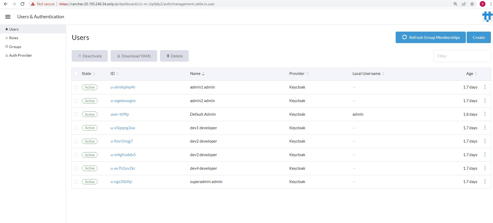

With this, we have successfully completed all required steps in Exercise 4. We are ready to move to the Exercise 5 [Exercise 5 - Rancher Roles & Assignment](./Exercise-5-Rancher-Role-Assignment-and-RBAC.md)

