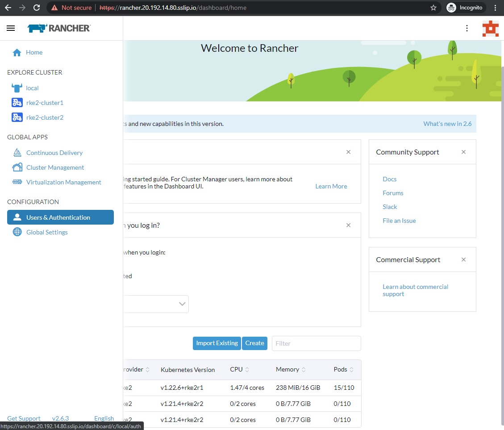

# Keycloak integration with Rancher

As a part the workshop we have deployed SUSE Rancher Server, Keycloak and EFK Stack for you.

The credentails for accessing above environemnt has been emailed to you on your registered email address which you have provided during workshop reistration.

## Keycloak User creation and role mapping

With this, we have successfully completed all required steps in Exercise 4. We are ready to move to the Exercise 5 [Exercise 5 - Rancher Roles & Assignment](./Exercise-5-Rancher-Role-Assignment-and-RBAC.md)

## Having trouble?

First, verify you have followed all written lab instructions (including the Before the Hands-on lab document).

Next, submit an issue with a detailed description of the problem.

Do not submit pull requests. Our content authors will make all changes and submit pull requests for approval.

If you are planning to present a workshop, review and test the materials early! We recommend at least two weeks prior.

Please allow 5 - 10 business days for review and resolution of issues.