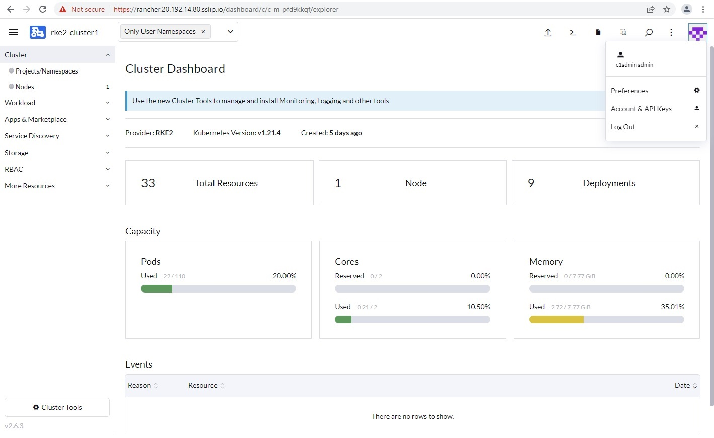
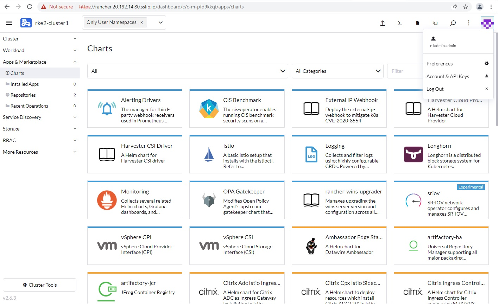
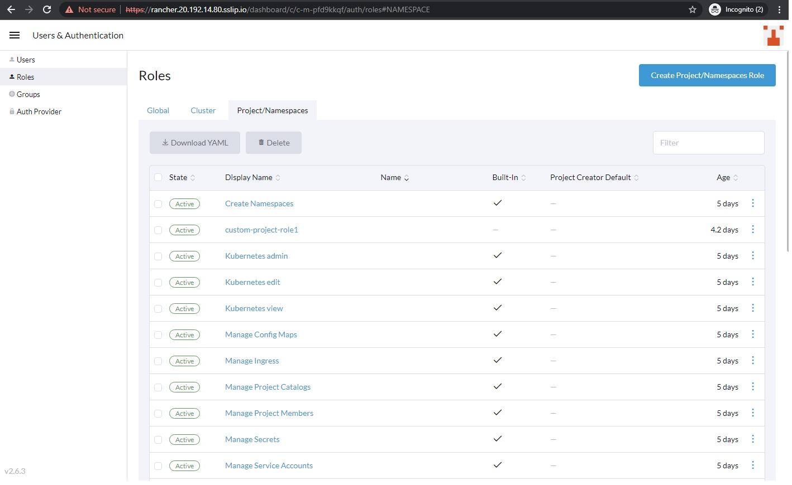
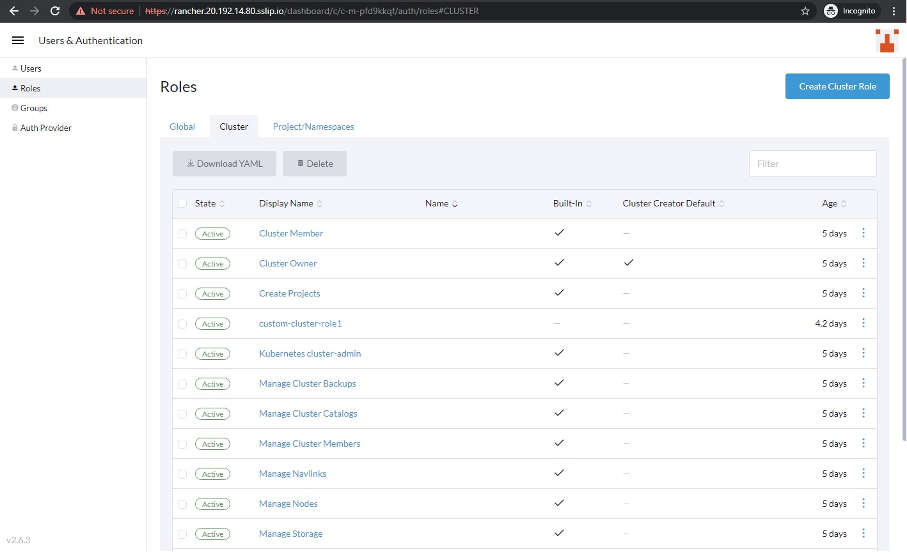

# Keycloak integration with Rancher

As a part the workshop we have deployed SUSE Rancher Server, Keycloak and EFK Stack for you.

The credentails for accessing above environemnt has been emailed to you on your registered email address which you have provided during workshop reistration.

## Rancher Role Assignment and RBAC

By now we know that the Keycloak users have very little access to the Rancher platform

For the users to perform the tasks they would need adequate permissions

<<<<<<<, to be update from documentation

## Assigning Global permission to Manage Rancher Platform

superadmin user is a regular user created in keycloak.

By default, Rancher assigns Standard User Role which allows him create and manage new clusters, however they will not be able to manage any other clusters as well as rancher management platform.

For him to manage Rancher management platform we need to elevate his permissions in Rancher and granting him global permissions of administrator.

Lets check the existing permissions superadmin user have in Rancher and elevate him to permissions of administrator.

login as "admin" user using Keycloak option and using the credentials as set during Excercise-2.

Navigate to Home > Configuration > Users & Authentication > Users

Click on the checkbox of superadmin user and click on 3 vertical dots and click Edit Config

<<<<<<<<<< highligh below image

The default Global Permissions are set to Standard User

We need to elevate his access to higher level to "Administrator" which has full permissions at the Rancher platform level and Downstream clusters.

Select "Administrator" and click Save

Re-login to Rancher UI using Keycloak option

Now you can see more options such as Continuous Delivery, Cluster Manager etc and all the downstream clusters

## Assigning Cluster level permission to Manage individual clusters

For the workshop we have pre-deployed 3 clusters in all.
Based on Organization structure we have 3 admins and 4 developers.
In the previous step we have elevated superadmin user to manage Rancher platform and all downstream cluster.
Now we have to explicitly assign the rest of the 2 admins to manage their own respective cluster.

In order to grant them explicit permissions to respective clusters we will need to grant user a cluster level permissions.

Now, we will now grant user "c1admin", role "Cluster Owner" in order to have full control of the cluster and all its resources.

Home > Explore CLUSTER > select "rke2-cluster1"

rke2-cluster1 > RBAC > select Cluster Members

Click Add button to add Cluster Members

Select "Owner" as the desired Cluster Permission and click "Create"

Upon success, we can now see user "c1admin" now has the role "Cluster Owner"

Lets validate by login as "c1admin" user on the Rancher UI

Now we can see rke2-cluster1 under Explore Cluster option

Apps and Market place are only accessible to cluster owners

We have successfully assigned user "c1admin" to manage cluster "rke2-cluster1"

Similarly you can repeat the above steps for user "c2admin" for cluster "rke2-cluster2".

So for we have configured role and permissions for cluster administrators, in this step we will have developers access to their respective namespaces in their assigned cluster for them to do their development work. 

## Manage Project/Namespaces

In the development team we have mix of senior and junior developers. The senior developers because of their role and experience are granted rights to create projects and namespaces. Junior developers are restricted to create namespaces only for their own development work.

Till now we have used default built-in roles and permissions, lets explore ways to create custom roles and permissions to meet very specific needs.

dev1 user will be assigned as built-in cluster member role as well as a custom role to create and manage projects and namespsaces.

dev2 user will be assigned custom role only to create and manage namspaces in existing projects.

dev2 user is not allowed to create any new projects.

### Create Custom Project Role

Login as "superadmin" 

Home >  Users & Authentication > Roles > Project/Namespaces > Create Prpject /Namesapces Role

Name = "custom-project-role1"

Under Grant Resources > Verbs > add below

create

delete

get

list

patch

update

watch

Resource = "Namespaces" (from dropdown)

In the previous step we have created custom project/namespace role.It cannot be assigned to users directly. They have to be first associated to custom cluster role and thereafter to the user. 

Next step is to create, custom cluster role

Home >  Users & Authentication > Roles > Cluster > Create Cluster Role

Name = "custom-cluster-role1"

Under Inherit From tab> select custom-project-role "custom-project-role1"

Keep default options under Grant Resources and hit create

Login as "c1admin"

Home> Explore Cluster > rke2-cluster1 > RBAC > Cluster Members > Click Add

Under Select Members dropdown option, select user "dev1"

Under Cluster Permissions > select "Member"  and click on Create 

To add and manage namespace explicitly the way we wanted using the custom role, we will now assign cluster permissions "custom-cluster-role1" and click create

login as dev1 user 

You can notice dev1 user has both create Project and create Namespace option

Create new project

Home > Explore Cluster > rke2-cluster1> Projects/Namesapces > Create Project

Name = dev1-user-project1

Setting resource limits

Under project > "dev1-user-project1" > Create Namespace

Login as "c1admin"

Home> Explore Cluster > rke2-cluster1 > RBAC > Cluster Members > Click Add

Under Select Members dropdown option, select user "dev2"

Under Cluster Permissions > select "custom-cluster-role1"  and click on Create 

Here, We have granted him custom cluster role only

Since we need to give him access to view project level view, so we assign built-in  additional custom role "view all projects" and click create

Finally we have assigned all built-in and custom roles for users "dev1" and "dev2"

logged in as dev2 user and you should now be able to create Namespace only

With this, we have successfully completed all required steps in Exercise 5: "Rancher role assignment and RBAC". 

We are now ready to move to the Exercise 6: [Exercise 6: Configure Rancher Logging](./Exercise-6-Configure-Rancher-Logging.md)

