## Rancher Logging using EFK Stack

In this **Exercise-6**, we will deploy and configure Rancher Logging and deploy sample Log Generator App.


### Connecting to Elastic Search

Lets verify the if Elastic search engine is up and running, view the **elastic search URL** and login with "**elastic**" user and credentials

Open lab-credentials file 

Look for keyword **"elastic_url"**, **"elastic_user"** and **"elastic_password"** 

Copy and past Elastic URL link in your favourite browser.

Elastic URL = **"elastic_url"**

user = **elastic**

password = **"elastic_password"**


The above details in the browser confirms Elastic search services are up and running.

### Connecting to Kibana Dashboard

Now lets verify the if Kibana service dashboard is available, view the Kibana URL

Open lab-credentials file 

Look for keyword **"kibana_url"**, **"elastic_user"** and **"elastic_password"** 

Copy and past Kibana URL link in your favourite browser.

Kibana URL = **"kibana_url"**

user = **elastic**

password = **"elastic_password"**


Click on **"Explore on my own"**


Next step is to deploy Rancher logging


### Deploying Rancher Logging

Home > Explore Cluster > rke2-cluster1 > App & Marketplace > Charts

Click **Logging**


Click on **Install**


Continue with **default options** and click on **Next**


Continue with **default options** and click on "**Install**"


**Logging** deployed successfully as depicted in the image below


Upon successful provisioning of Rancher Logging, you will see logging option available, upon expanding you will find **four** options. 

1. **ClusterFlows**

2. **ClusterOutputs**

3. **Flows**

4. **Outputs**


#### Configure Secrets

Prior to configuring cluster output, lets configure secrets which would be required during cluster output configuration

Home > Explore Cluster > rke2-cluster1 > Storage > Secrets

Click **Create**


Select "**Opaque**" option


Use below options to populate the form

Namespace = **cattle-logging-system**

Name = **my-elastic**

Key = **password**

Value = < **elastic_password** >  Refer lab-credentails


#### Configure Cluster Outputs

Home > Explore Cluster > rke2-cluster1 > Logging > ClusterOutputs

Click **Create**


Select from dropdown

Output = **Elasticsearch**


Target

Scheme = **https**

Host = < **elastic server IP address** >  Refer lab-credentials

Index Name = **fluentd**

Access 

User = **elastic**

Secret Key from Secret = **my-elastic** (from the dropdown)

key = **password**  (from the dropdown)

Click on **Create**


Hit 3 vertical dots to **Edit YAML**


Copy the below lines under **"spec:"** section, as depicted in the image below

```
    ssl_verify: false
    ssl_version: TLSv1_2
```


Copy the below lines under **"spec:"** section, as depicted in the image below

```
    include_timestamp: true
    buffer:
      timekey: 1m
      timekey_wait: 30s
      timekey_use_utc: true
```


Final ClusterOutputs should look as below


We have configured the cluster level output for **rke2-cluster1** to Elastic Search

#### Deploy Sample App - Log Generator

Now we will deploy sample application which will generate continuous logs and we will forward these logs to Elastic Search

Home > Explore Cluster > rke2-cluster1 >Workload > Deployments

Click **Create**

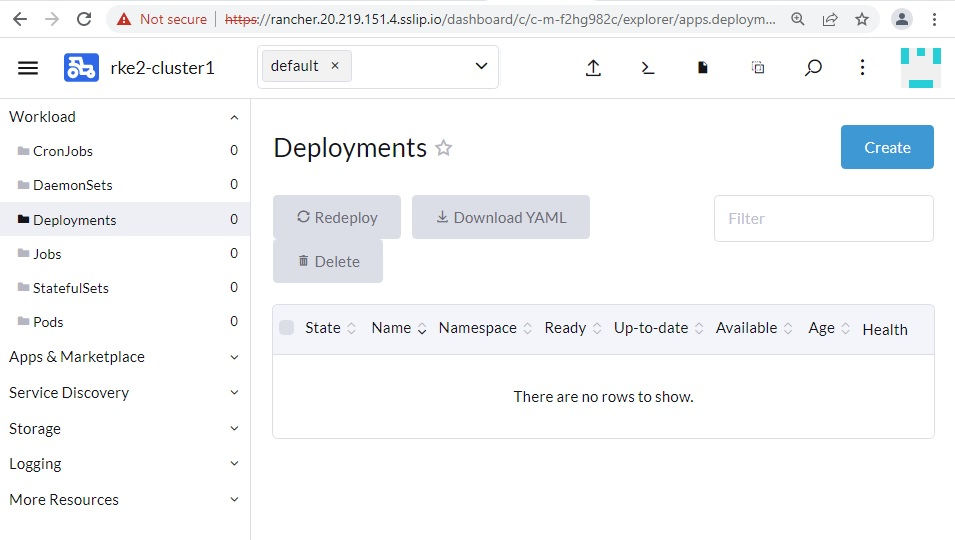

Click on Icon with up arrow key **"Import YAML"**

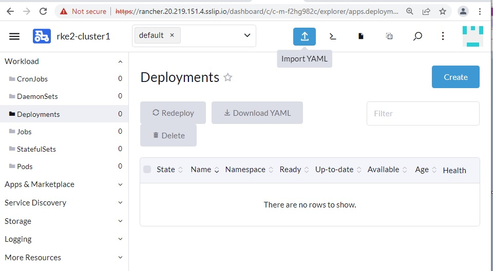


Copy the below yaml definition code into the pop up window and click on **import**

```
apiVersion: apps/v1
kind: Deployment
metadata:
 name: log-generator
spec:
 selector:
   matchLabels:
     app.kubernetes.io/name: log-generator
 replicas: 1
 template:
   metadata:
     labels:
       app.kubernetes.io/name: log-generator
   spec:
     containers:
     - name: nginx
       image: banzaicloud/log-generator:0.3.2
```


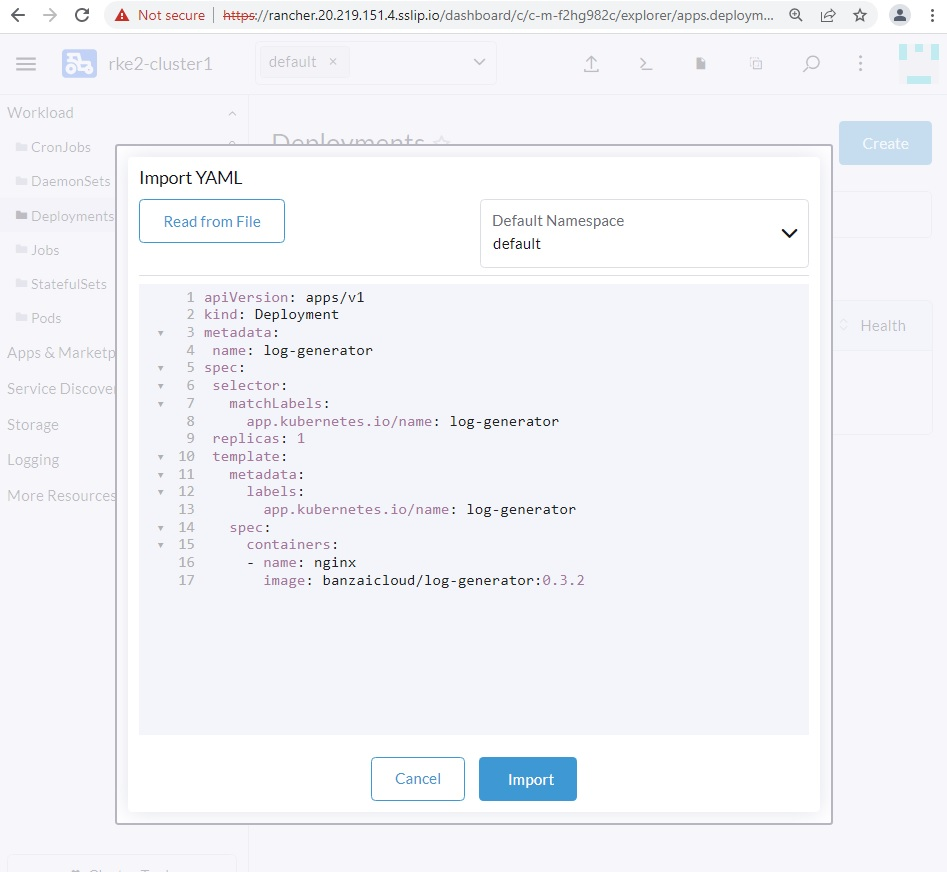

This will create the deployment name "**Log-generator**". Its a simple deployment with 1 replicas for the log generator pod which will generate logs. 

Click **Close**

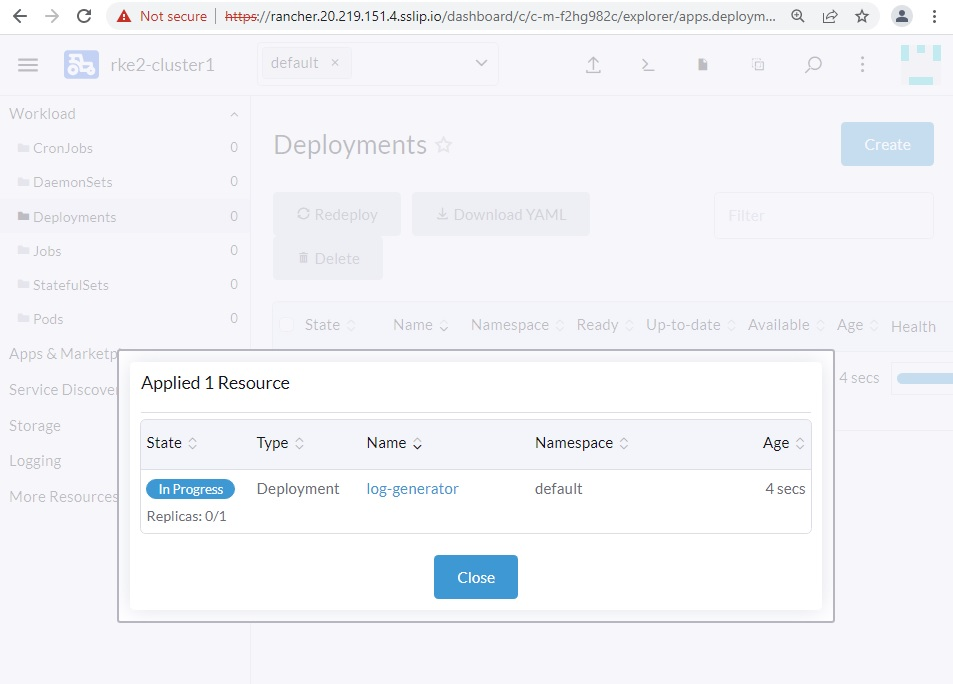

We can see our Deployments "**Log generator**" is **Active** & up & working with (1/1) pod & 1 pod is available. 

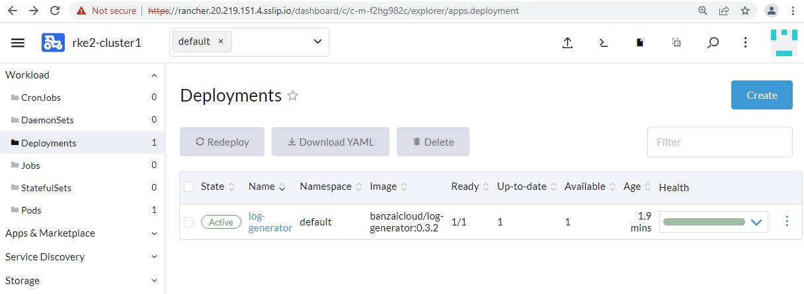

To view the logs, click on the 3 vertical dots & click on '**View Logs**'

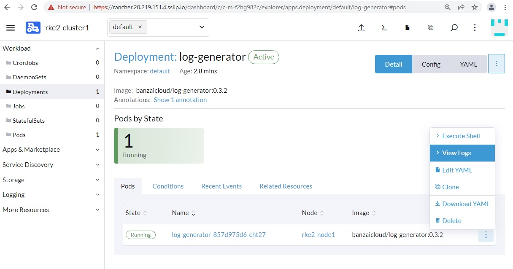

Below are the logs generated by the pod. 

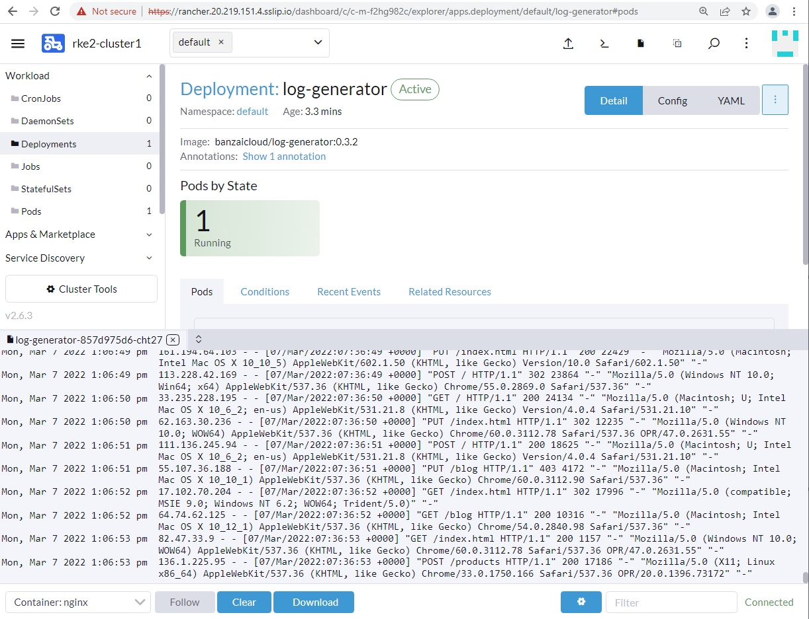


#### Configure Flows

Final step is to configure Flow.

Home > Explore Cluster > rke2-cluster1 > Logging 

Click **Flows**

Namespace = **default**

Name = **my-app-log**

In the Matches Form, you can specify Pods by giving Pod Labels, Nodes by specifying which nodes you would like to collect logs. 

You can also limit logs from specific containers. 

In our case we will leave it as default. 

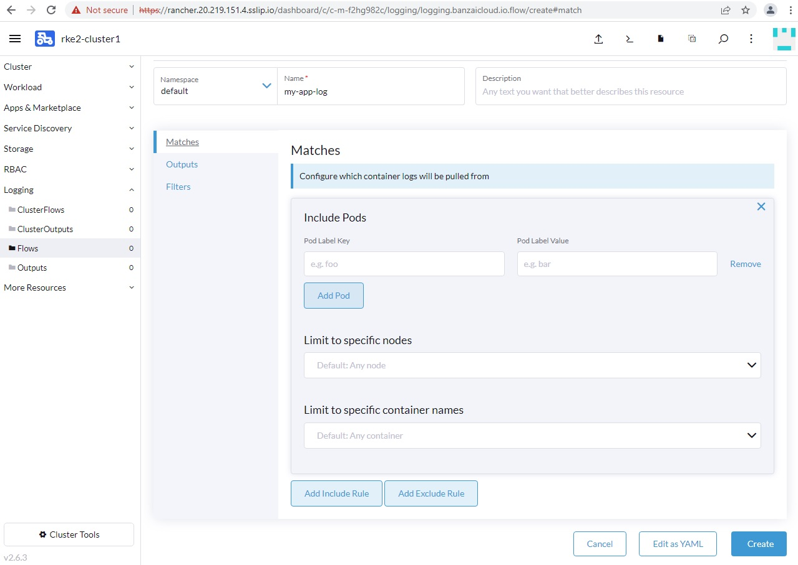

In the Output form, click on the drop down to select the Cluster Output we created "**my-elastic**"

Cluster Output = **my-elastic**

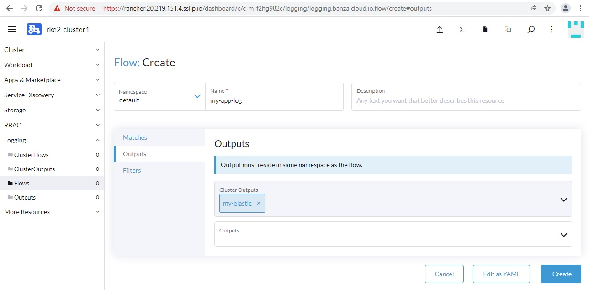

Click on '**Create**'

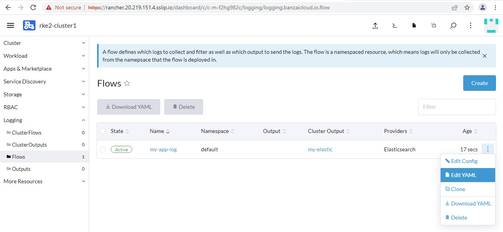

Click on the 3 vertical got to edit the YAML definition for the flow to include the below parse. Copy the below lines under spec: section, as depicted in the image below

```
  filters:
    - tag_normaliser: {}
    - parser:
        remove_key_name_field: true
        reserve_data: true
        parse:
          type: nginx
  match:
     - select:
         labels:
           app.kubernetes.io/name: log-generator
```

Upon adding the parse you final flow definition would look like below. 

Click **Save**

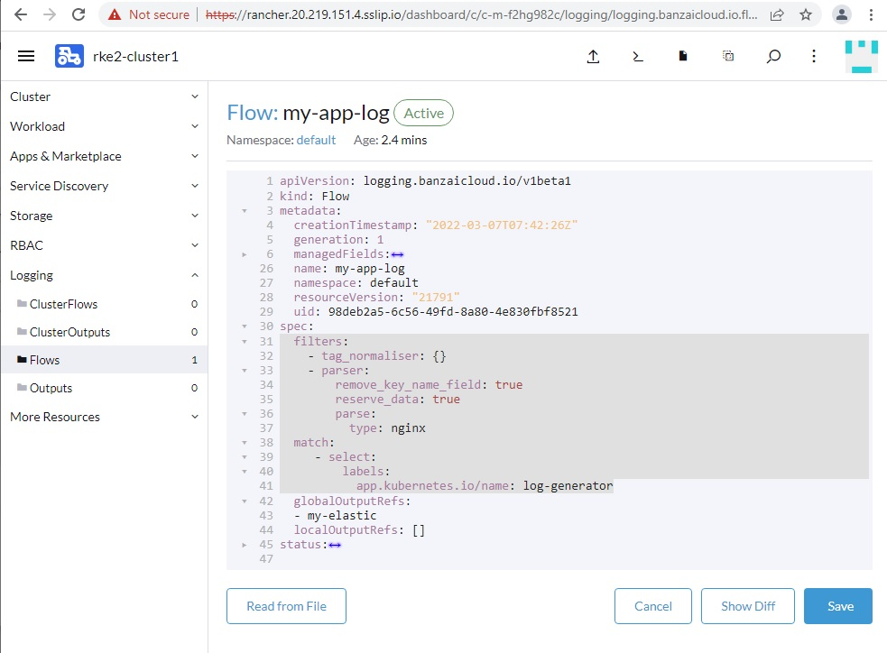

Logging Flow created successfully. 

With this, we have successfully completed all required steps in **Exercise 6: "Configure Rancher Logging"**. 

In the next section we will view the application logs generated from rke2-cluster into Elastic search.

We are now ready to move to the **Exercise 7: [Exercise 7: View Logs using Kibana Dashboard](./Exercise-7-View-Logs-Using-Kibana-Dashboard.md)**