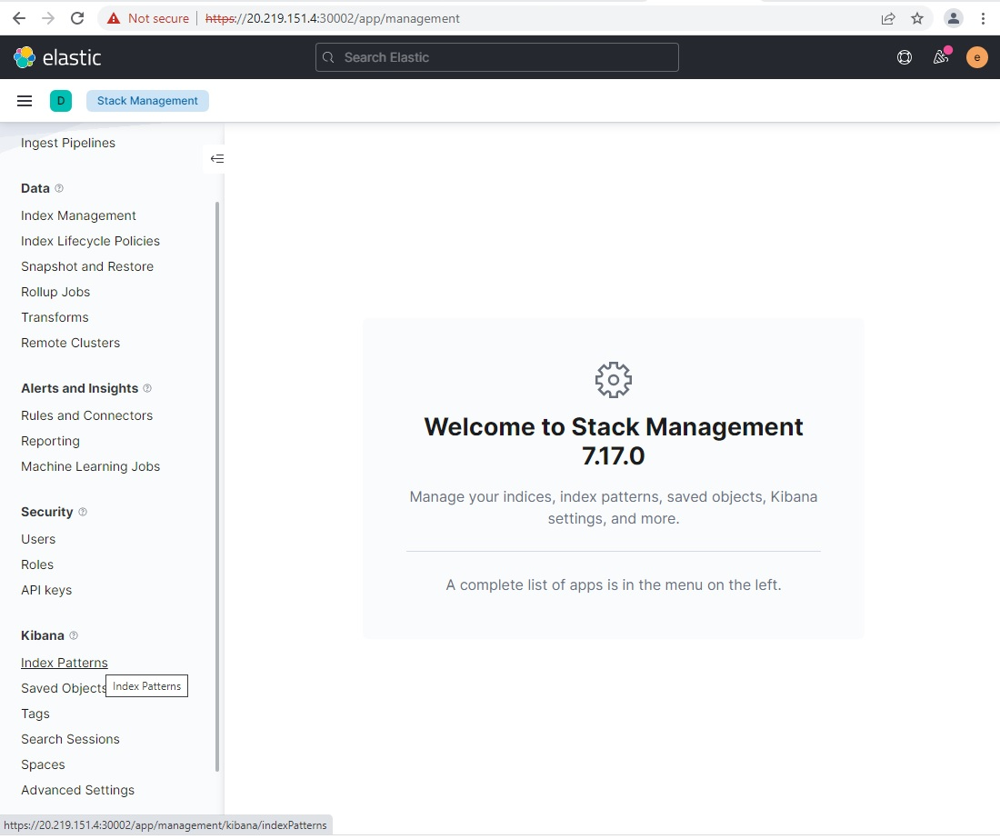
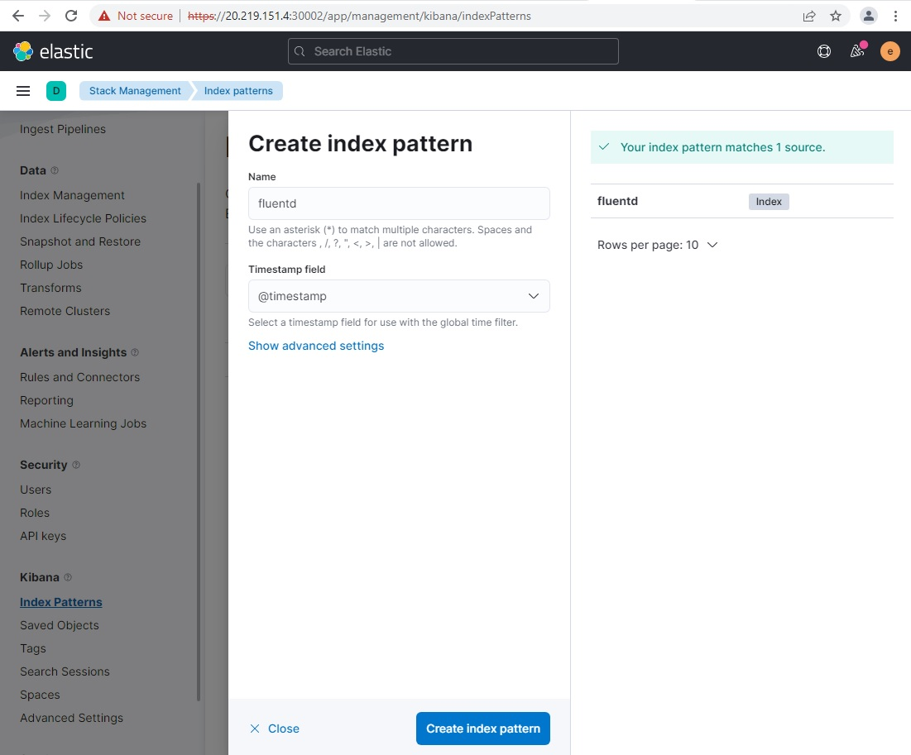
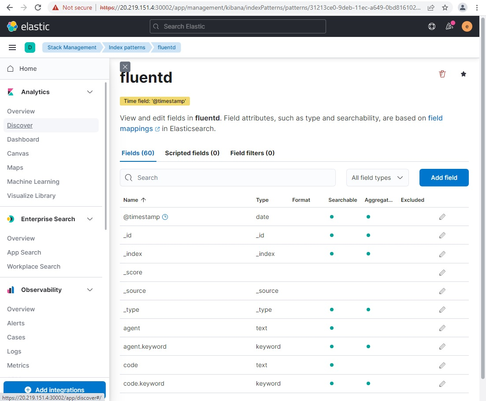
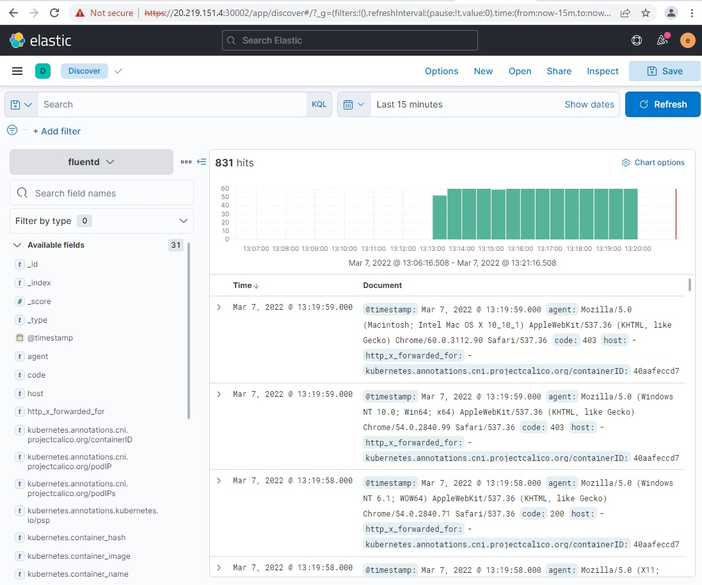
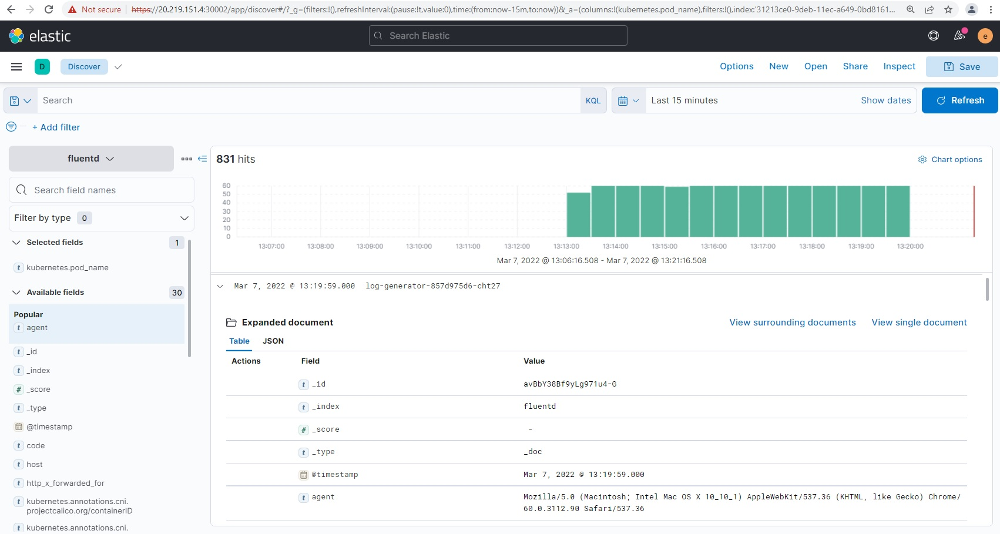
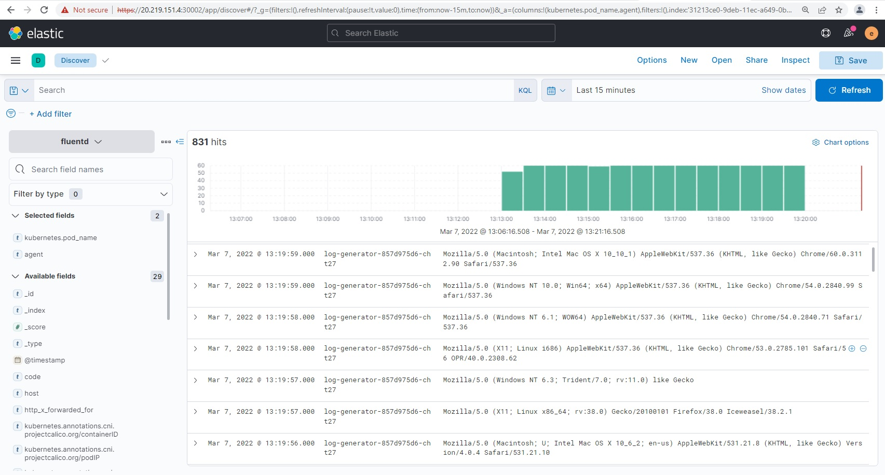

# Rancher Logging using EFK Stack

## View Logs using Kibana Dashboard

Open Kibana Dashboard 

Kibana > Stack Management > Kibana > Index Patterns

Name = fluentd

Timestap field = @timestamp

Click on **'Create Index Pattern'**

Analytics > Discover > Available fields > Select field

1. Kubernetes.pod_name
2. Agents

We will see reduced data stream & logs from the pods will be visible. 

With this, we have successfully completed integration of Keycloak with Rancher and successfully demonstrated Rancher Roles assignments and RBAC.

In the next section we will showcase EFK stack integration with SUSE Rancher.

